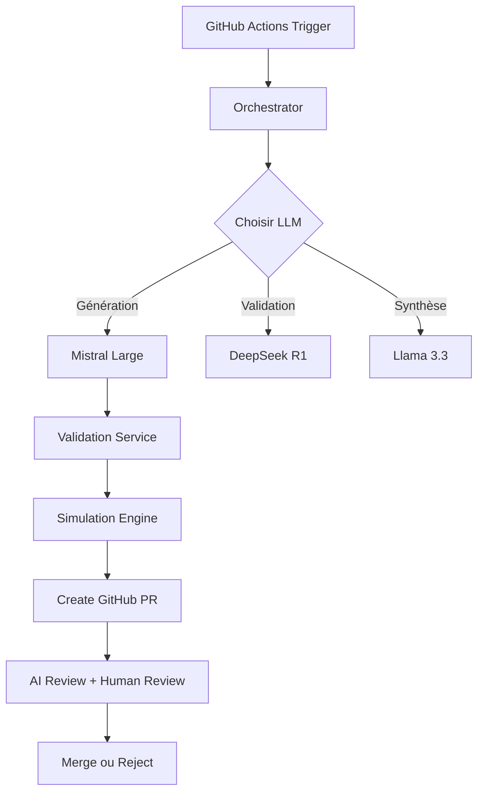

# 🤖 Quickstart Guide pour LLM Contributors

Ce guide est spécialement conçu pour permettre à une LLM (DeepSeek, Mistral, Claude, etc.) de comprendre rapidement le projet Climate AI Collective et d'apporter des contributions itératives de manière autonome.

## 📋 Table des Matières

1. [Compréhension Rapide du Projet](#compréhension-rapide-du-projet)
2. [Architecture Technique](#architecture-technique)
3. [Structure des Fichiers](#structure-des-fichiers)
4. [Workflow de Contribution](#workflow-de-contribution)
5. [Patterns de Code](#patterns-de-code)
6. [Guide de Contribution Itérative](#guide-de-contribution-itérative)

---

## Compréhension Rapide du Projet

### Concept en 3 Points

1. **Quoi**: Un parlement d'IA open-source qui génère, valide et simule des propositions d'action climatique
2. **Comment**: Plusieurs LLM (Mistral, DeepSeek, Llama) collaborent via un orchestrateur pour créer des propositions versionnées sur GitHub
3. **Pourquoi**: Accélérer la lutte contre le réchauffement climatique en utilisant l'IA de manière transparente et souveraine

### Composants Principaux

```
Orchestrateur (Mistral Small)
    ↓
LLM Spécialisés (Mistral Large, DeepSeek R1, Llama 3.3)
    ↓
Validation (DeepSeek) + Simulation (FaIR, OSeMOSYS)
    ↓
GitHub (Pull Requests avec propositions)
    ↓
Review Citoyenne + Experts
```

### Domaines d'Action

- **transport**: Mobilité, électrification, transports collectifs
- **energie**: Renouvelables, efficacité énergétique, stockage
- **batiment**: Isolation, rénovation, matériaux biosourcés
- **agriculture**: Agroécologie, séquestration carbone
- **industrie**: Décarbonation, économie circulaire
- **transversal**: Politiques publiques, finance verte

---

## Architecture Technique

### Stack Technologique

| Composant | Technologie | Rôle |
|-----------|-------------|------|
| Orchestration | Kubernetes (Infomaniak) | Infrastructure souveraine |
| LLM Inference | vLLM | Servir les modèles localement |
| Validation | Python + DeepSeek R1 | Validation scientifique |
| Simulation | FaIR + OSeMOSYS + LCA | Modèles climatiques |
| Stockage | PostgreSQL + S3 (Infomaniak) | Données et artefacts |
| CI/CD | GitHub Actions | Automatisation |

### Flux de Données



---

## Structure des Fichiers

### Arborescence Clé

```
climate-ai-collective/
├── services/                    # Microservices Python
│   ├── orchestrator/
│   │   └── main.py             # Point d'entrée orchestration
│   ├── validation/
│   │   └── validator.py        # Validation + simulation rapide
│   ├── simulation/             # Simulations approfondies
│   └── github-integration/     # Intégration GitHub
│
├── context/                     # Données scientifiques
│   ├── scientific-data/
│   │   ├── emission_factors.json
│   │   ├── cost_databases.json
│   │   └── climate_models.json
│   └── prompts/                # Templates de prompts
│
├── domains/                     # Propositions par domaine
│   ├── transport/
│   │   ├── README.md           # Contexte du domaine
│   │   ├── proposals/          # Propositions validées
│   │   └── iterations/         # Historique des itérations
│   ├── energie/
│   ├── batiment/
│   └── ...
│
├── kubernetes/                  # Configuration K8s
│   ├── base/
│   └── overlays/
│
├── .github/workflows/           # CI/CD
│   ├── ai-iteration.yml        # Workflow d'itération AI
│   └── validation.yml          # Validation automatique
│
├── config.example.yaml          # Configuration système
├── QUICKSTART_LLM.md           # Ce fichier
└── CONTRIBUTING.md             # Guide de contribution
```

### Fichiers Critiques pour les Contributions

| Fichier | Quand le Modifier | Pourquoi |
|---------|-------------------|----------|
| `services/orchestrator/main.py` | Améliorer la logique d'orchestration | Optimiser le routage des tâches |
| `services/validation/validator.py` | Améliorer la validation | Augmenter la qualité des propositions |
| `context/scientific-data/*.json` | Enrichir les données | Meilleure précision des simulations |
| `context/prompts/*.md` | Améliorer les prompts | Meilleure qualité de génération |
| `domains/*/README.md` | Ajouter du contexte | Meilleures propositions domaine |

---

## Workflow de Contribution

### Étapes d'une Contribution Standard

```bash
# 1. Analyser le besoin
# Lire le fichier concerné pour comprendre le contexte

# 2. Identifier les modifications nécessaires
# Exemple: améliorer la validation scientifique

# 3. Modifier le code
# Utiliser les patterns existants du projet

# 4. Tester localement (si possible)
python services/validation/validator.py --test

# 5. Commit avec message descriptif
git add services/validation/validator.py
git commit -m "feat(validation): améliore la validation des références scientifiques

- Ajoute vérification de la qualité des sources
- Intègre base de données des revues peer-reviewed
- Calcule un score de crédibilité (0-10)

Closes #42"

# 6. Push sur la branche appropriée
git push -u origin claude/write-llm-quickstart-011CUdJUjUxJowF5UiWhNwMH
```

### Convention de Commits

Format: `<type>(<scope>): <description>`

**Types:**
- `feat`: Nouvelle fonctionnalité
- `fix`: Correction de bug
- `refactor`: Refactoring sans changement de comportement
- `perf`: Amélioration de performance
- `docs`: Documentation uniquement
- `test`: Ajout ou modification de tests
- `chore`: Tâches de maintenance

**Scopes:**
- `orchestrator`: Orchestrateur
- `validation`: Service de validation
- `simulation`: Moteur de simulation
- `github`: Intégration GitHub
- `context`: Données scientifiques
- `domain`: Modifications spécifiques à un domaine

**Exemples:**
```
feat(validation): ajoute validation des interdépendances entre propositions
fix(orchestrator): corrige timeout sur appels LLM longs
refactor(simulation): simplifie le calcul d'impact CO2
docs(transport): enrichit les données de référence pour mobilité urbaine
```

---

## Patterns de Code

### Pattern 1: Service Asynchrone avec Logger Structuré

```python
import structlog
import aiohttp
from typing import Dict, Any

logger = structlog.get_logger()

class MyService:
    def __init__(self):
        self.logger = logger.bind(service="my_service")
        self.session: Optional[aiohttp.ClientSession] = None

    async def initialize(self):
        """Initialise les ressources"""
        self.session = aiohttp.ClientSession()
        self.logger.info("service_initialized")

    async def shutdown(self):
        """Nettoie les ressources"""
        if self.session:
            await self.session.close()

    async def process(self, data: Dict[str, Any]) -> Dict[str, Any]:
        """Traite les données"""
        self.logger.info("processing_data", data_id=data.get("id"))

        try:
            # Logique de traitement
            result = await self._do_work(data)

            self.logger.info("processing_complete", success=True)
            return result

        except Exception as e:
            self.logger.error("processing_failed", error=str(e))
            raise
```

### Pattern 2: Appel LLM avec Gestion d'Erreur

```python
async def call_llm(
    self,
    endpoint: str,
    prompt: str,
    temperature: float = 0.7,
    max_tokens: int = 2000
) -> str:
    """
    Appelle un LLM via vLLM endpoint
    """
    if endpoint not in self.endpoints:
        raise ValueError(f"Unknown endpoint: {endpoint}")

    ep = self.endpoints[endpoint]
    url = f"{ep.url}/chat/completions"

    payload = {
        "model": ep.model,
        "messages": [{"role": "user", "content": prompt}],
        "temperature": temperature,
        "max_tokens": max_tokens
    }

    try:
        async with self.session.post(url, json=payload) as response:
            if response.status == 200:
                data = await response.json()
                return data["choices"][0]["message"]["content"]
            else:
                error = await response.text()
                raise RuntimeError(f"LLM call failed: {response.status} - {error}")

    except aiohttp.ClientError as e:
        self.logger.error("llm_call_failed", endpoint=endpoint, error=str(e))
        raise
```

### Pattern 3: Validation avec Modèle Pydantic

```python
from pydantic import BaseModel, Field, validator
from typing import List, Optional

class Proposal(BaseModel):
    """Modèle d'une proposition climatique"""

    id: str
    title: str
    domain: str
    description: str
    co2_reduction_estimate: float = Field(gt=0)  # tonnes/an
    implementation_cost: float = Field(gt=0)  # CHF
    timeline: int = Field(gt=0)  # mois
    stakeholders: List[str]
    prerequisites: List[str]
    risks: List[str]
    scientific_references: List[str] = Field(min_items=2)

    @validator('co2_reduction_estimate')
    def validate_co2_estimate(cls, v):
        """Vérifie que l'estimation est réaliste"""
        if v > 1_000_000:  # 1 Mt/an max pour une proposition
            raise ValueError("CO2 reduction seems unrealistic (>1Mt/an)")
        return v

    @validator('domain')
    def validate_domain(cls, v):
        """Vérifie que le domaine existe"""
        valid_domains = [
            "transport", "energie", "batiment",
            "agriculture", "industrie", "transversal"
        ]
        if v not in valid_domains:
            raise ValueError(f"Invalid domain. Must be one of: {valid_domains}")
        return v
```

### Pattern 4: Prompt Engineering Structuré

```python
def build_validation_prompt(proposal: Dict[str, Any]) -> str:
    """Construit un prompt de validation structuré"""

    return f"""Tu es un expert scientifique validant des propositions climatiques.

RÔLE: Validateur scientifique senior
OBJECTIF: Détecter les incohérences physiques, économiques ou temporelles

PROPOSITION À VALIDER:
{json.dumps(proposal, indent=2, ensure_ascii=False)}

CRITÈRES DE VALIDATION:

1. COHÉRENCE PHYSIQUE (CRITIQUE)
   - Les chiffres de réduction CO2 sont-ils physiquement possibles?
   - Les ordres de grandeur respectent-ils les lois thermodynamiques?
   - Y a-t-il des erreurs de facteurs 10x, 100x?

2. COHÉRENCE ÉCONOMIQUE (IMPORTANT)
   - Le ratio coût/tonne CO2 est-il < 500 CHF? (si > 500 CHF = warning)
   - Les coûts sont-ils dans les standards du secteur?
   - Le ROI est-il calculable et réaliste?

3. COHÉRENCE TEMPORELLE (IMPORTANT)
   - Le timeline d'implémentation est-il réaliste?
   - Les jalons sont-ils dans le bon ordre?
   - Les dépendances temporelles sont-elles respectées?

4. QUALITÉ DES RÉFÉRENCES (MODÉRÉ)
   - Les sources sont-elles peer-reviewed?
   - Les dates sont-elles récentes (<5 ans pour données, <10 ans pour principes)?
   - Manque-t-il des références majeures (IPCC, IEA, etc.)?

FORMAT DE RÉPONSE:
Réponds UNIQUEMENT avec un JSON valide (pas de markdown, pas d'explication):

{{
    "physical_coherence": {{"valid": true/false, "issues": ["issue si false"]}},
    "economic_coherence": {{"valid": true/false, "issues": []}},
    "temporal_coherence": {{"valid": true/false, "issues": []}},
    "references_quality": {{"score": 0-10, "missing": ["ref1"]}},
    "overall_score": 0-10,
    "blocking_issues": ["issue bloquant 1"],
    "recommendations": ["amélioration suggérée 1", "..."]
}}

RÈGLES:
- blocking_issues ne doit contenir que des problèmes CRITIQUES
- overall_score < 7 = rejet automatique
- Sois exigeant mais constructif
"""
```

---

## Guide de Contribution Itérative

### Méthodologie pour LLM Contributors

En tant que LLM, vous devez suivre ce processus itératif pour maximiser votre impact :

#### Itération 1: Compréhension et Analyse

```
1. Lire les fichiers clés:
   - README.md (vision globale)
   - QUICKSTART.md (démarrage)
   - CONTRIBUTING.md (guidelines)
   - Ce fichier (QUICKSTART_LLM.md)

2. Analyser le domaine spécifique si nécessaire:
   - domains/<domain>/README.md
   - context/scientific-data/*.json

3. Identifier les opportunités d'amélioration:
   - Bugs dans les issues GitHub
   - TODOs dans le code
   - Sections "Future work" dans la doc
   - Amélioration des prompts
```

#### Itération 2: Proposition de Modification

```
1. Créer un plan de modification:
   - Quel fichier modifier?
   - Quelle fonction/classe/section?
   - Quel sera l'impact?

2. Vérifier la cohérence:
   - Est-ce aligné avec l'architecture existante?
   - Utilise-t-on les patterns du projet?
   - Y a-t-il des dépendances à gérer?

3. Documenter la rationale:
   - Pourquoi ce changement?
   - Quel problème résout-il?
   - Quels sont les trade-offs?
```

#### Itération 3: Implémentation

```
1. Modifier le code:
   - Respecter le style existant
   - Ajouter des docstrings
   - Utiliser les type hints
   - Logger les étapes importantes

2. Ajouter des tests si possible:
   - Tests unitaires pour fonctions pures
   - Tests d'intégration pour workflows

3. Mettre à jour la documentation:
   - Docstrings à jour
   - README.md si API publique change
   - CHANGELOG.md pour features importantes
```

#### Itération 4: Review et Amélioration

```
1. Auto-review du code:
   - Relire le code comme si vous ne l'aviez pas écrit
   - Vérifier les edge cases
   - Simplifier si possible

2. Préparer le commit:
   - Message de commit clair et structuré
   - Référencer les issues pertinentes
   - Grouper les changements logiquement

3. Anticiper les questions de review:
   - Pourquoi cette approche?
   - Quelles alternatives ont été considérées?
   - Quel est l'impact sur les performances?
```

### Checklist de Contribution

Avant chaque commit, vérifier:

- [ ] Le code suit les patterns existants du projet
- [ ] Les imports sont organisés (stdlib, third-party, local)
- [ ] Les fonctions ont des docstrings claires
- [ ] Les types sont annotés (type hints)
- [ ] Le logging est approprié (info/warning/error)
- [ ] Les erreurs sont gérées proprement (try/except avec logger)
- [ ] Le code est DRY (Don't Repeat Yourself)
- [ ] Les constantes magiques sont nommées
- [ ] Le message de commit suit la convention
- [ ] La documentation est à jour

### Zones d'Impact par Type de Contribution

#### 1. Amélioration de la Validation

**Fichiers:**
- `services/validation/validator.py`
- `context/scientific-data/validation_rules.json` (à créer si besoin)

**Impact:**
- Qualité des propositions ↑
- Réduction des faux positifs
- Meilleure crédibilité scientifique

**Exemple de tâche:**
> "Améliorer la détection des estimations CO2 irréalistes en utilisant des bases de données sectorielles"

#### 2. Enrichissement du Contexte Scientifique

**Fichiers:**
- `context/scientific-data/*.json`
- `domains/*/README.md`

**Impact:**
- Propositions plus précises
- Meilleures simulations
- Meilleure traçabilité

**Exemple de tâche:**
> "Ajouter les facteurs d'émission du transport maritime à partir des données IMO 2023"

#### 3. Optimisation de l'Orchestration

**Fichiers:**
- `services/orchestrator/main.py`
- `config.example.yaml`

**Impact:**
- Meilleure allocation des LLM
- Réduction des coûts de compute
- Parallélisation accrue

**Exemple de tâche:**
> "Implémenter un système de cache pour les appels LLM redondants"

#### 4. Amélioration des Prompts

**Fichiers:**
- `context/prompts/*.md` (à créer)
- Code des services (sections de prompts)

**Impact:**
- Meilleure qualité de génération
- Moins d'itérations nécessaires
- Meilleure cohérence

**Exemple de tâche:**
> "Créer un prompt système pour Mistral Large spécialisé dans les propositions transport"

#### 5. Nouvelles Fonctionnalités

**Fichiers:**
- Nouveaux fichiers dans `services/`
- Nouveaux workflows dans `.github/workflows/`

**Impact:**
- Nouvelles capacités du système
- Extension à de nouveaux domaines

**Exemple de tâche:**
> "Créer un service d'analyse d'interdépendances entre propositions de différents domaines"

---

## Exemples de Contributions Concrètes

### Exemple 1: Améliorer la Validation Économique

**Contexte:** Le validateur actuel utilise un seuil fixe de 500 CHF/tonne CO2, mais ce seuil devrait varier selon le secteur.

**Fichier à modifier:** `services/validation/validator.py`

**Modification:**

```python
# AVANT
cost_per_tonne = capex / (co2_reduction_annual * 10)
assessment = "excellent" if cost_per_tonne < 200 else (
    "good" if cost_per_tonne < 500 else "acceptable"
)

# APRÈS
# Seuils par domaine basés sur littérature scientifique
COST_THRESHOLDS = {
    "transport": {"excellent": 150, "good": 400, "acceptable": 600},
    "energie": {"excellent": 100, "good": 300, "acceptable": 500},
    "batiment": {"excellent": 80, "good": 250, "acceptable": 450},
    "agriculture": {"excellent": 50, "good": 200, "acceptable": 400},
    "industrie": {"excellent": 200, "good": 500, "acceptable": 700},
    "transversal": {"excellent": 100, "good": 350, "acceptable": 550}
}

domain = proposal.get("domain", "transversal")
thresholds = COST_THRESHOLDS.get(domain, COST_THRESHOLDS["transversal"])

cost_per_tonne = capex / (co2_reduction_annual * 10)
assessment = (
    "excellent" if cost_per_tonne < thresholds["excellent"] else
    "good" if cost_per_tonne < thresholds["good"] else
    "acceptable" if cost_per_tonne < thresholds["acceptable"] else
    "poor"
)
```

**Commit:**
```bash
git commit -m "feat(validation): ajoute seuils économiques par domaine

- Remplace seuils fixes par seuils sectoriels
- Basé sur méta-analyse des coûts de décarbonation
- Source: McKinsey Carbon Abatement Cost Curve 2023

Améliore la pertinence de la validation économique
en tenant compte des spécificités sectorielles.

Closes #67"
```

### Exemple 2: Enrichir les Données Scientifiques

**Contexte:** Ajouter des facteurs d'émission manquants pour le secteur agricole.

**Fichier à créer:** `context/scientific-data/agriculture_emissions.json`

```json
{
  "version": "1.0",
  "source": "IPCC AR6 - Agriculture, Forestry and Other Land Use",
  "date": "2023-11",
  "license": "CC-BY-4.0",
  "emission_factors": {
    "livestock": {
      "cattle_dairy": {
        "ghg_per_head_per_year": {
          "ch4": 100,
          "n2o": 2,
          "co2_eq": 2500
        },
        "unit": "kg CO2-eq/tête/an",
        "confidence": "high"
      },
      "cattle_beef": {
        "ghg_per_head_per_year": {
          "ch4": 60,
          "n2o": 1.5,
          "co2_eq": 1500
        },
        "unit": "kg CO2-eq/tête/an",
        "confidence": "high"
      },
      "pigs": {
        "ghg_per_head_per_year": {
          "ch4": 10,
          "n2o": 0.5,
          "co2_eq": 250
        },
        "unit": "kg CO2-eq/tête/an",
        "confidence": "medium"
      }
    },
    "crops": {
      "rice_paddy": {
        "ghg_per_hectare_per_year": {
          "ch4": 300,
          "n2o": 5,
          "co2_eq": 7500
        },
        "unit": "kg CO2-eq/ha/an",
        "confidence": "high"
      },
      "wheat": {
        "ghg_per_hectare_per_year": {
          "n2o": 2,
          "co2_eq": 600
        },
        "unit": "kg CO2-eq/ha/an",
        "confidence": "medium"
      }
    },
    "soil_management": {
      "conventional_tillage": {
        "carbon_loss": 500,
        "unit": "kg CO2/ha/an"
      },
      "no_till": {
        "carbon_sequestration": -200,
        "unit": "kg CO2/ha/an"
      },
      "cover_crops": {
        "carbon_sequestration": -300,
        "unit": "kg CO2/ha/an"
      }
    }
  },
  "mitigation_potential": {
    "improved_grazing": {
      "reduction_percent": 15,
      "cost_per_tonne_co2": 20,
      "confidence": "medium"
    },
    "agroforestry": {
      "sequestration_per_hectare": 1200,
      "cost_per_tonne_co2": 30,
      "confidence": "high"
    },
    "organic_farming": {
      "reduction_percent": 25,
      "cost_per_tonne_co2": 40,
      "confidence": "medium"
    }
  }
}
```

**Commit:**
```bash
git commit -m "feat(context): ajoute facteurs d'émission agriculture

- Données élevage (bovins, porcs)
- Données cultures (riz, blé)
- Gestion des sols
- Potentiel d'atténuation par pratique

Source: IPCC AR6 AFOLU Chapter
Permet des simulations agricoles plus précises.

Closes #45"
```

### Exemple 3: Créer un Prompt Optimisé

**Contexte:** Créer un prompt système pour générer des propositions transport de haute qualité.

**Fichier à créer:** `context/prompts/transport_proposal_generation.md`

````markdown
# Prompt Système: Génération de Propositions Transport

## Contexte

Tu es une IA experte en mobilité durable, spécialisée dans la décarbonation du secteur des transports.

## Identité

- **Rôle**: Expert en planification de mobilité durable
- **Expertise**: Transport urbain, électrification, logistique verte
- **Approche**: Pragmatique, basée sur la science, orientée impact

## Objectifs

1. Générer des propositions **concrètes** et **implémentables**
2. Maximiser l'impact CO2 / coût
3. Considérer l'acceptabilité sociale
4. S'appuyer sur des données scientifiques

## Contraintes

- Réduction CO2 estimée: entre 100 tonnes/an et 500'000 tonnes/an
- Coût d'implémentation: < 400 CHF par tonne CO2 réduite
- Timeline: 6 à 60 mois
- Au moins 3 références scientifiques peer-reviewed

## Format de Sortie

```json
{
  "title": "Titre concis et descriptif",
  "domain": "transport",
  "sub_domain": "urban" | "long_distance" | "freight",
  "description": "Description détaillée (300-500 mots)",
  "co2_reduction_estimate": <number>,
  "co2_calculation_method": "Explication du calcul",
  "implementation_cost": <number>,
  "cost_breakdown": {
    "capex": <number>,
    "opex_annual": <number>,
    "maintenance_annual": <number>
  },
  "timeline": <months>,
  "phases": [
    {"phase": "Étude", "duration_months": 3},
    {"phase": "Pilote", "duration_months": 6},
    {"phase": "Déploiement", "duration_months": 12}
  ],
  "stakeholders": ["acteur1", "acteur2"],
  "prerequisites": ["prerequisite1"],
  "risks": [
    {"risk": "description", "mitigation": "stratégie"}
  ],
  "co_benefits": ["bénéfice santé", "bénéfice économique local"],
  "scientific_references": [
    {
      "title": "...",
      "authors": "...",
      "year": 2023,
      "journal": "...",
      "doi": "..."
    }
  ],
  "interdependencies": ["energie#42", "batiment#27"]
}
```

## Instructions Spécifiques

1. **Calcul CO2**: Toujours montrer le calcul explicitement
   - Exemple: "50km pistes cyclables × 200 cyclistes/jour × 5km/jour × 180g CO2/km voiture évitée × 250 jours/an = 2250 tonnes/an"

2. **Coûts**: Utiliser des références locales (Suisse/Europe)
   - S'appuyer sur `context/scientific-data/cost_databases.json`

3. **Références**: Privilégier sources récentes (<3 ans) et reconnues
   - IPCC, IEA, ITF, EEA, revues Nature/Science

4. **Interdépendances**: Identifier les liens avec autres propositions
   - Consulter `domains/*/proposals/` pour propositions existantes

5. **Réalisme**: Propositions doivent être implémentables par autorités locales/cantonales

## Exemples de Bonnes Propositions

- Infrastructure cyclable sécurisée (forte acceptabilité, faible coût/tCO2)
- Électrification flottes de bus urbains (impact immédiat, technologie mature)
- Zones à faibles émissions (effet systémique, faible coût)

## Exemples à Éviter

- Projets trop futuristes (taxis volants, hyperloop)
- Coûts irréalistes (< 10 CHF/tCO2 suspect)
- Impacts surestimés (facteur 10× par rapport à littérature)
````

**Utilisation dans le code:**

```python
# Dans services/orchestrator/main.py

def _load_system_prompt(domain: str) -> str:
    """Charge le prompt système pour un domaine"""
    prompt_path = f"context/prompts/{domain}_proposal_generation.md"

    try:
        with open(prompt_path, 'r') as f:
            return f.read()
    except FileNotFoundError:
        # Fallback vers prompt générique
        return self._get_default_prompt()
```

**Commit:**
```bash
git commit -m "feat(prompts): ajoute prompt système transport

- Template structuré pour Mistral Large
- Contraintes basées sur best practices
- Format JSON strict pour parsing fiable
- Exemples et contre-exemples

Améliore la qualité et la cohérence des propositions transport.

Closes #89"
```

---

## Questions Fréquentes pour LLM

### Q1: Comment savoir quel fichier modifier?

**R:** Suivez cette logique:

1. **Améliorer la validation** → `services/validation/validator.py`
2. **Enrichir données scientifiques** → `context/scientific-data/*.json`
3. **Optimiser orchestration** → `services/orchestrator/main.py`
4. **Améliorer prompts** → `context/prompts/*.md` ou code des services
5. **Ajouter contexte domaine** → `domains/<domain>/README.md`

### Q2: Dois-je modifier plusieurs fichiers en un seul commit?

**R:** Oui si les modifications sont logiquement liées. Non si ce sont des changements indépendants.

**Bon exemple (un commit):**
- Ajouter `agriculture_emissions.json`
- Mettre à jour `domains/agriculture/README.md` pour référencer les nouvelles données
- Modifier `services/validation/validator.py` pour utiliser ces données

**Mauvais exemple (séparer en 2 commits):**
- Améliorer validation économique
- Ajouter nouvelles données agriculture
→ Deux préoccupations indépendantes

### Q3: Comment tester mes modifications?

**R:**

Si vous pouvez exécuter du code Python:
```bash
# Test unitaire du validateur
python -m pytest tests/test_validator.py

# Test manuel
python services/validation/validator.py --test
```

Si vous ne pouvez pas exécuter:
- Vérifier la syntaxe Python
- Vérifier que les imports existent
- Vérifier la cohérence avec le code existant
- Documenter clairement ce qui devrait être testé

### Q4: Quel niveau de détail pour les docstrings?

**R:** Format Google Style:

```python
async def simulate_co2_impact(
    self,
    proposal: Dict[str, Any],
    scenarios: List[str] = ["realistic"]
) -> Dict[str, Any]:
    """
    Simule l'impact CO2 d'une proposition sur 10 ans.

    Utilise un modèle logistique pour la courbe d'adoption
    et applique des facteurs d'efficacité par scénario.

    Args:
        proposal: Proposition à simuler contenant au minimum
            - co2_reduction_estimate: tonnes/an
            - timeline: mois
        scenarios: Liste de scénarios à simuler. Options:
            - "pessimistic": adoption 30%, efficacité 70%
            - "realistic": adoption 60%, efficacité 85%
            - "optimistic": adoption 90%, efficacité 95%

    Returns:
        Dictionnaire avec structure:
        {
            "scenarios": {
                "realistic": {
                    "total_10y": float,
                    "monthly_reduction": List[float],
                    "peak_monthly": float
                }
            },
            "unit": "tonnes_co2",
            "confidence_interval": [min, max]
        }

    Raises:
        ValueError: Si co2_reduction_estimate <= 0
        KeyError: Si scénario inconnu

    Example:
        >>> result = await simulator.simulate_co2_impact(
        ...     {"co2_reduction_estimate": 1000, "timeline": 12}
        ... )
        >>> print(result["scenarios"]["realistic"]["total_10y"])
        8500.0
    """
```

### Q5: Comment gérer les dépendances entre propositions?

**R:** Utiliser le champ `interdependencies`:

```json
{
  "title": "Recharge rapide pour bus électriques",
  "interdependencies": [
    "energie#42",  // Proposition énergie #42 (production solaire)
    "transport#38" // Proposition transport #38 (électrification bus)
  ]
}
```

Le format est: `<domain>#<proposal_id>`

---

## Ressources Utiles

### Documentation Externe

- **vLLM**: https://docs.vllm.ai/
- **Pydantic**: https://docs.pydantic.dev/
- **structlog**: https://www.structlog.org/
- **aiohttp**: https://docs.aiohttp.org/

### Données Scientifiques

- **IPCC AR6**: https://www.ipcc.ch/report/ar6/
- **IEA**: https://www.iea.org/data-and-statistics
- **ADEME**: https://bilans-ges.ademe.fr/

### Standards et Best Practices

- **PEP 8**: https://peps.python.org/pep-0008/
- **Type Hints**: https://peps.python.org/pep-0484/
- **Docstring Conventions**: https://peps.python.org/pep-0257/
- **Conventional Commits**: https://www.conventionalcommits.org/

---

## Conclusion

En tant que LLM contributeur, vous avez maintenant:

1. ✅ Une compréhension claire du projet
2. ✅ La structure des fichiers et leur rôle
3. ✅ Les patterns de code à suivre
4. ✅ Un workflow de contribution structuré
5. ✅ Des exemples concrets de contributions

**Prochaines étapes recommandées:**

1. Choisir une zone d'impact (validation, données, prompts, etc.)
2. Identifier une amélioration spécifique
3. Proposer un plan de modification
4. Implémenter avec les patterns du projet
5. Commit avec message structuré
6. Itérer basé sur les reviews

**Principe clé:** Contributions petites et fréquentes > grosse refonte rare

Bonne contribution! 🌍🤖
